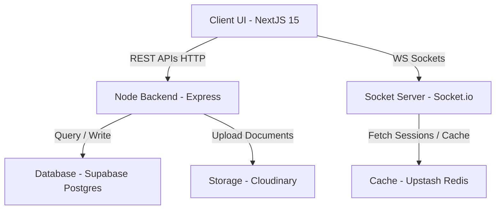
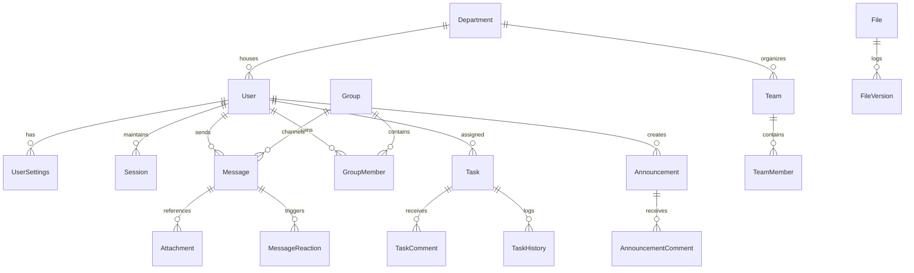

# ConnectHub - Enterprise Internal Communication & Collaboration Platform

ConnectHub is a comprehensive, production-ready enterprise-grade collaboration platform. It integrates real-time communications, project Kanban boards, a cloud document folder drive, and security audit logs into a unified portal.

---

## Architecture Diagram



---

## Database ER Diagram



---

## Folder Layout Structure

```
ConnectHub/
├── backend/
│   ├── src/
│   │   ├── config/          # Database, redis, cloudinary, mailer connections
│   │   ├── controllers/     # Controller handlers (auth, user, chat, tasks, admin)
│   │   ├── middleware/      # Middlewares (auth, role check, validation, upload)
│   │   ├── routes/          # API route registries
│   │   ├── services/        # Socket.io, BullMQ async task queues
│   │   ├── utils/           # Zod schema validation constraints
│   │   └── index.ts         # Server entry point
│   ├── prisma/
│   │   ├── schema.prisma    # PostgreSQL Prisma models
│   │   └── seed.ts          # Default DB seeding script
│   └── Dockerfile
├── frontend/
│   ├── src/
│   │   ├── app/             # Next.js 15 routing folder structure
│   │   ├── components/      # UI components & Providers
│   │   ├── hooks/           # useSocket context client hook
│   │   ├── lib/             # Zustand state store and cn class utility
│   │   └── services/        # API network client calls
│   └── Dockerfile
├── docker-compose.yml       # Dev container orchestrator
└── README.md
```

---

## Installation & Deployment Guide

### Run via Docker Compose (Recommended)

1. Make sure you have **Docker** and **Docker Compose** installed.
2. Run the compose up command:
   ```bash
   npm run docker:up
   ```
   This will spin up local containers for Postgres, Redis, Express, and Next.js automatically.
3. Access the application:
   - **Frontend**: [http://localhost:3000](http://localhost:3000)
   - **Backend health status check**: [http://localhost:5000/health](http://localhost:5000/health)

### Running Locally (Manual Steps)

1. Install dependencies inside both subdirectories:
   ```bash
   npm run install:all
   ```
2. Configure environmental parameters in `/backend/.env` and `/frontend/.env`.
3. Run migrations and database seed:
   ```bash
   cd backend
   npx prisma migrate dev
   npm run seed
   ```
4. Start both dev servers:
   - **Backend**: `npm run dev` (run inside `/backend`)
   - **Frontend**: `npm run dev` (run inside `/frontend`)

---

## Default Seeding Users & Credentials

Use the following accounts for login testing:

| Role | Email Address | Password |
|---|---|---|
| **Admin** | `admin@connecthub.com` | `password123` |
| **Manager** | `manager@connecthub.com` | `password123` |
| **Employee** | `employee@connecthub.com` | `password123` |
